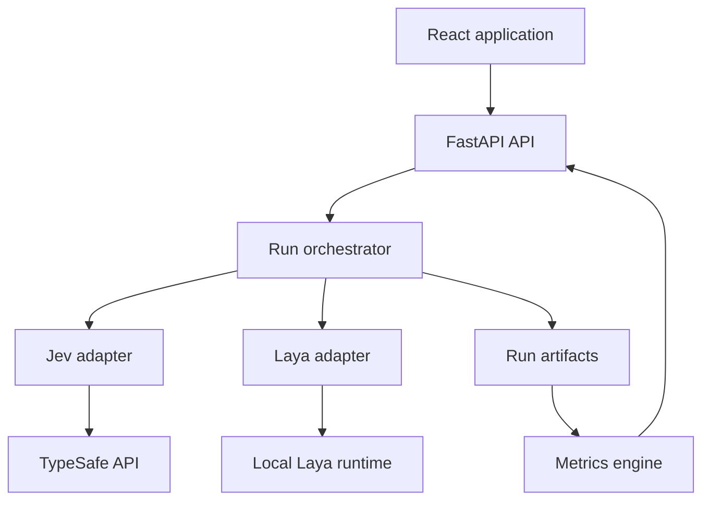
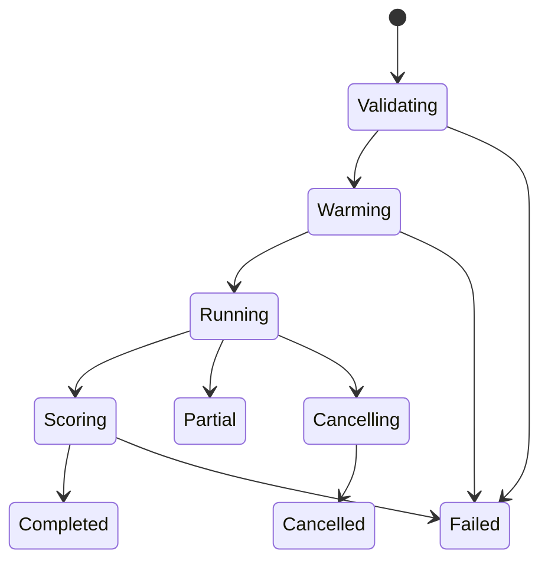

# Technical Requirements Document

## 1. Technical objective

Implement a local evaluation platform that executes paired Jev and Laya decisions, preserves raw evidence, computes reproducible metrics, and exposes the complete workflow through a React application.

The prototype favors a small, inspectable architecture over distributed infrastructure.

## 2. Architecture



### Request path

1. React submits a validated run configuration.
2. FastAPI creates a run manifest and starts an asynchronous run task.
3. The orchestrator loads cases, randomizes execution order from a recorded seed, and warms both adapters.
4. Each adapter executes the same canonical cases.
5. Normalized predictions and raw responses are appended immediately to disk.
6. Progress events are sent over server-sent events.
7. The metrics engine reads stored predictions and writes summary artifacts.
8. React renders summaries while preserving links to case-level evidence.

## 3. Technology choices

### Backend

| Area | Choice | Reason |
|---|---|---|
| Runtime | Python 3.11+ | Required by current ML and API libraries; simple local tooling |
| API | FastAPI | Typed endpoints, async support, SSE-friendly |
| Validation | Pydantic v2 | Shared canonical contracts and clear import errors |
| Data processing | pandas + NumPy | Straightforward grouped metrics and exports |
| Metrics | scikit-learn + local implementations | Standard metrics plus auditable custom calculations |
| Jev integration | TypeSafe Python SDK | Native provider contract and usage metadata |
| Laya integration | `laya` package and `Router` | Recommended local route with checkpoint metadata |
| Persistence | JSON, JSONL, optional Parquet | Inspectable and sufficient for a prototype |
| Tests | pytest | Unit, integration, and fixture-driven adapter tests |

### Frontend

| Area | Choice | Reason |
|---|---|---|
| Framework | React + TypeScript + Vite | Fast prototype with strong typing |
| Styling | Tailwind CSS + shadcn/ui | Professional and consistent component system |
| Motion | Framer Motion | Controlled page, panel, list, and value transitions |
| Data fetching | TanStack Query | Caching, retries, and predictable async states |
| Local UI state | Zustand or React context | Lightweight filters and comparison state |
| Charts | Recharts | Accessible React-native charts and custom tooltips |
| Tables | TanStack Table | Sorting, filtering, virtualization-ready case explorer |
| Tests | Vitest + React Testing Library + Playwright | Component, interaction, and end-to-end coverage |

## 4. Repository structure

```text
decisionlab/
├── README.md
├── pyproject.toml
├── package.json
├── .env.example
├── config/
│   └── default.yaml
├── evals/
│   ├── demo.jsonl
│   ├── development.jsonl
│   └── sealed.jsonl
├── backend/
│   ├── app/
│   │   ├── main.py
│   │   ├── api/
│   │   │   ├── health.py
│   │   │   ├── datasets.py
│   │   │   └── runs.py
│   │   ├── adapters/
│   │   │   ├── base.py
│   │   │   ├── jev.py
│   │   │   └── laya.py
│   │   ├── evaluation/
│   │   │   ├── loader.py
│   │   │   ├── validator.py
│   │   │   ├── orchestrator.py
│   │   │   ├── normalizer.py
│   │   │   └── metrics.py
│   │   ├── services/
│   │   │   ├── event_bus.py
│   │   │   ├── report_service.py
│   │   │   └── run_store.py
│   │   └── schemas/
│   │       ├── cases.py
│   │       ├── predictions.py
│   │       └── runs.py
│   └── tests/
├── frontend/
│   ├── src/
│   │   ├── app/
│   │   ├── components/
│   │   ├── features/
│   │   │   ├── setup/
│   │   │   ├── live-run/
│   │   │   ├── overview/
│   │   │   ├── reliability/
│   │   │   ├── robustness/
│   │   │   └── case-explorer/
│   │   ├── charts/
│   │   ├── hooks/
│   │   ├── lib/
│   │   └── types/
│   └── tests/
├── runs/
└── docs/
```

The implementation may combine very small modules, but adapter, metric, storage, and UI feature boundaries must remain explicit.

## 5. Canonical adapter contract

```python
class DecisionAdapter(Protocol):
    adapter_id: str

    async def readiness(self) -> ReadinessResult: ...
    async def warmup(self) -> WarmupResult: ...
    async def predict(self, case: EvaluationCase) -> Prediction: ...
    async def close(self) -> None: ...
```

Both adapters consume the same `EvaluationCase`. Provider-specific transformations are limited to serialization and must be included in prediction metadata.

### Jev adapter

- Requires `TYPESAFE_API_KEY` on the backend.
- Uses a versioned model ID rather than a moving alias for final evaluations.
- Measures end-to-end request duration with a monotonic clock.
- Captures provider usage, cost, model identifier, request identifier, and raw response when available.
- Uses bounded retries only for declared transient errors.
- Does not retry semantic or validation failures.

### Laya adapter

- Loads one `Router` instance per backend process.
- Records package version, checkpoint repository/revision, route, device, and effective context settings.
- Performs a warm-up request before measured latency.
- Runs blocking inference outside the FastAPI event loop.
- Serializes model access by default unless the installed runtime is explicitly verified as concurrency-safe.
- Records cold-start and warm-inference latency separately.

## 6. Run orchestration

### State machine



### Rules

- Run IDs are ULIDs or UUIDv7 values.
- The run manifest is written before execution begins.
- Case order is randomized from a recorded seed.
- Warm-up requests are marked and excluded from quality and warm-latency metrics.
- Primary quality evaluation uses one logical question per case.
- Batching and throughput are separate suites so batching cannot alter the quality baseline silently.
- Results are appended after each provider response to preserve partial progress.
- A case is complete only when every selected system has either a prediction or a recorded failure.
- Cancellation prevents new work, allows in-flight calls to settle within a timeout, and marks the run partial/cancelled.

## 7. Execution modes

### Quality mode

- Parallelism: one per adapter by default.
- Same canonical cases and randomized order.
- Measures correctness and probability quality.

### Robustness mode

- Groups variants by `family_id`.
- Calculates invariance relative to the base case.
- Preserves each variant as an independent prediction record.

### Repeatability mode

- Repeats a stratified sample a configured number of times.
- Adds a unique non-semantic request ID only if required to avoid provider caching.
- Measures label flips and probability drift.

### Performance mode

- Separate from quality results.
- Measures cold start, warm p50/p95/p99, batching, and configured concurrency.
- Records whether time includes network transit.

## 8. Metric engine

The metrics engine must be a pure transformation from immutable run artifacts to summary artifacts.

```python
summary = compute_metrics(
    cases=cases,
    predictions=predictions,
    scoring_version="1.0.0",
)
```

Requirements:

- deterministic ordering;
- no provider calls;
- no mutation of predictions;
- explicit handling of missing answers;
- grouping by system, track, primitive, domain, variant, option-count bucket, and context-length bucket;
- confidence intervals generated from a recorded bootstrap seed;
- metric definitions stored in the report.

## 9. Persistence

Each run is a self-contained directory:

```text
runs/<run-id>/
├── manifest.json
├── cases.snapshot.jsonl
├── predictions.jsonl
├── events.jsonl
├── errors.jsonl
├── summary.json
├── report.md
├── report.html
└── environment.json
```

### Persistence guarantees

- Files are UTF-8.
- JSONL records are written atomically per line and flushed regularly.
- Completed raw predictions are never rewritten.
- Derived summaries may be rebuilt with a new scoring version while preserving previous summaries if published.
- Secrets and authorization headers must be removed before raw-response persistence.
- Dataset snapshots store the evaluated cases, unless a sealed-set policy permits only a digest and aggregate output.

## 10. API and live events

REST endpoints and payloads are defined in `API-DATA-SPEC.md`.

Server-sent events are preferred over WebSockets because the browser only needs a reliable server-to-client progress stream. Event IDs must be monotonic within a run. On reconnect, the client sends `Last-Event-ID` and receives missed events when available, then refreshes the run snapshot.

## 11. Frontend architecture

- Routes are lazy-loaded by feature.
- TanStack Query owns server data; local filters do not duplicate canonical run data.
- The selected run and filters are encoded in the URL where practical.
- Large case tables use row virtualization after the initial prototype threshold.
- Chart components consume already-normalized API view models rather than calculating core metrics in the browser.
- Framer Motion wraps page and component transitions, but numerical truth comes from backend artifacts.
- The live page distinguishes provisional values from final scored results.

## 12. Configuration

Example:

```yaml
run:
  track: default
  seed: 20260924
  suites: [quality, robustness, repeatability, performance]
  repetitions: 5

jev:
  model: jev-1.13.0
  timeout_seconds: 30
  max_retries: 2

laya:
  mode: router
  device: auto
  preload: true

metrics:
  ece_bins: 10
  confidence_thresholds: [0.60, 0.70, 0.80, 0.90]
  bootstrap_samples: 2000

storage:
  root: ./runs
```

All effective defaults are copied into the run manifest.

## 13. Security

- `.env` is ignored by Git.
- The frontend receives readiness booleans, never secret values.
- Logs redact bearer tokens, authorization headers, and configured secret patterns.
- Imported JSONL is treated as untrusted input and validated before rendering or transmission.
- React renders text as text; raw HTML from state or responses is never injected.
- Export filenames and paths are generated by the backend and cannot escape the run root.
- Jev transmission requires a visible disclosure because case state leaves the local machine.
- Laya model files are downloaded only from the configured repository/revision.

## 14. Error handling

### Dataset errors

Return line number, JSON path, expected type, and correction guidance. A dataset with blocking errors cannot start.

### Provider errors

Classify as:

- authentication;
- rate limit;
- timeout/network;
- invalid request;
- context limit;
- model/runtime;
- normalization;
- unknown.

Failures remain visible and count toward completion/failure metrics.

### Metric errors

If one metric cannot be computed, other metrics still render. The unavailable metric includes a reason and affected sample count.

## 15. Observability

Structured local logs include:

- timestamp;
- run ID;
- case ID;
- adapter ID;
- phase;
- latency;
- retry count;
- outcome;
- sanitized error.

The UI should not require log inspection for normal failures. Logs support debugging only.

## 16. Testing strategy

### Unit tests

- schema validation;
- adapter normalization;
- probability checks;
- metric formulas;
- risk–coverage ordering;
- robustness-family grouping;
- redaction;
- run state transitions.

### Contract tests

- stored fixtures for Jev and Laya responses;
- all three primitives;
- malformed and partial responses;
- probability sums and label mappings.

### Integration tests

- fake adapters execute a complete run without network or weights;
- cancellation preserves partial artifacts;
- metric regeneration is deterministic;
- SSE reconnect returns a correct snapshot.

### End-to-end tests

- import a fixture dataset;
- create a run with fake adapters;
- monitor progress;
- open all result views;
- inspect a disagreement;
- export a report.

Live provider smoke tests are opt-in and never run in ordinary CI.

## 17. Deployment

The prototype supports:

1. backend launched with Uvicorn;
2. React development server during development;
3. production React build served by FastAPI or a small static server;
4. optional Docker Compose for repeatable local setup.

The Laya weight cache is mounted as a persistent host volume. Jev credentials are injected at runtime. No public ingress is required.

## 18. Technical definition of done

- Identical canonical cases run through both adapters.
- Every result is normalized and persisted with raw evidence.
- A refresh does not lose run progress.
- Metrics rebuild deterministically.
- Default and tuned tracks cannot be combined accidentally.
- The React UI covers setup, live execution, analysis, case inspection, metadata, and export.
- Tests pass without live provider access.
- A live smoke test succeeds for each provider when credentials and weights are available.

